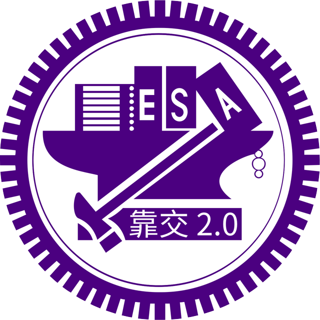

# 靠北交大 2.0 (xNCTU)

不要問為何沒有人審文，先承認你就是沒有人。

新版靠北交大讓全校師生都有了審核的權限，每天穩定發出投稿文章

## 社群平台
- Telegram: [@xNCTU](https://t.me/xNCTU)
- Plurk: [@xNCTU](https://plurk.com/xNCTU)
- Twitter: [@x_NCTU](https://twitter.com/x_NCTU)
- Facebook: [@xNCTU](https://fb.me/xNCTU)

## 審文機制
新版靠北交大 2.0 採自助式審文，所有交大師生皆可加入審核者的行列

## 排程發文
通過審核之文章將會進入發文佇列，由系統每 10 分鐘 po 出一篇至各大社群平台
